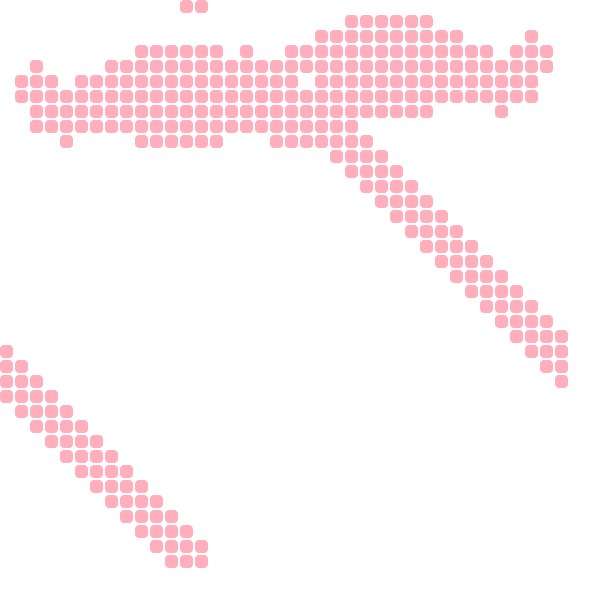

# Game of life SVG Generator

This is a simple implementation of Conway's game of life which can be used to
generate SVG/HTML files of the results.

## Example

```bash
./game-of-life --seed example-imports/gosper-glider-gun.csv -s 2 --tick 75 --time 10 -c "#FFAEBC" -bg "#B4F8C8"
```
